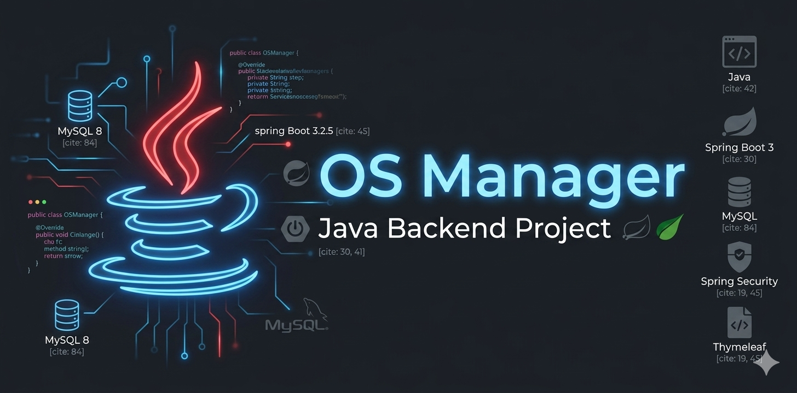

<p align="center">
  
</p>

<br>

# OS Manager

Sistema de gerenciamento de ordens de serviço desenvolvido com **Java** e **Spring Boot 3**, criado como projeto prático durante minha formação como desenvolvedor backend.

---

## Sobre o Projeto

Este projeto nasceu da vontade de construir algo além dos tutoriais — uma aplicação real, com autenticação, banco de dados, controle de acesso e interface web funcional.

O sistema permite abrir, acompanhar e encerrar ordens de serviço, gerenciar clientes e equipamentos, e exportar relatórios em PDF.

---

##  Tecnologias Utilizadas

| Tecnologia | Finalidade |
| :--- | :--- |
| ☕ **Java 17** | Linguagem principal |
| 🍃 **Spring Boot 3.2.5** | Framework base |
| 🗄️ **Spring Data JPA** | Persistência e ORM |
| 🔒 **Spring Security** | Autenticação e autorização |
| 🐬 **MySQL 8** | Banco de dados relacional |
| 🎨 **Thymeleaf** | Interface web (templates HTML) |
| 🦎 **Lombok** | Redução de código repetitivo |
| 📄 **OpenPDF** | Geração de relatórios em PDF |
| 🖌️ **Bootstrap 5** | Estilização da interface |

---

## Estrutura do Projeto

```

src/main/java/com/osmanager/
├── config/         → Configurações gerais (redirecionamentos)
├── controller/     → Controladores MVC e endpoints REST
├── dto/            → Objetos de transferência de dados
├── entity/         → Entidades JPA (tabelas do banco)
├── repository/     → Acesso ao banco de dados
├── security/       → Configuração de login e autorização
└── service/        → Regras de negócio

```

---

## Funcionalidades

- [x] Login com autenticação via Spring Security e senha criptografada (BCrypt)
- [x] Controle de acesso por perfil: `ADMIN` e `TECNICO`
- [x] Cadastro, edição e exclusão de **Clientes**
- [x] Cadastro e listagem de **Equipamentos**
- [x] Abertura, acompanhamento e encerramento de **Ordens de Serviço**
- [x] Numeração automática de OS (`OS-AAAAMMDD-XXXX`)
- [x] Dashboard com indicadores em tempo real
- [x] Exportação de OS em **PDF**
- [x] Interface responsiva com Bootstrap 5

---

##  Como Rodar o Projeto

### Pré-requisitos

- [JDK 17](https://www.oracle.com/java/technologies/downloads/)
- [MySQL 8+](https://dev.mysql.com/downloads/installer/)
- [Git](https://git-scm.com/)

---

### 1. Clonar o repositório

```bash
git clone git clone https://github.com/claudiodeveloper-github/osmanager.git
cd osmanager
```

---

### 2. Criar o banco de dados

No MySQL (Workbench, DBeaver ou terminal):

```sql
CREATE DATABASE osmanager;
```

> O Hibernate cria as tabelas automaticamente na primeira execução.

---

### 3. Configurar o `application.properties`

Edite o arquivo em `src/main/resources/application.properties`:

```properties
spring.datasource.url=jdbc:mysql://localhost:3306/osmanager
spring.datasource.username=seu_usuario
spring.datasource.password=sua_senha

spring.jpa.hibernate.ddl-auto=update
spring.jpa.show-sql=true
spring.jpa.properties.hibernate.dialect=org.hibernate.dialect.MySQLDialect

server.port=8080
```

---

### 4. Criar o primeiro usuário ADMIN

Como não há tela de cadastro público, insira o primeiro usuário diretamente no banco:

```sql
INSERT INTO usuario (nome, email, senha, role)
VALUES (
    'Administrador',
    'admin@osmanager.com',
    '$2a$10$7QfBPHHd0N6GdqQlCHXEK.0TrOn/R8xFNsNpQrZqMBGtW4kCnKi0a',
    'ADMIN'
);
```

> Senha em texto: `admin123`

---

### 5. Executar

```bash
# Linux / Mac
./mvnw spring-boot:run

# Windows
mvnw.cmd spring-boot:run
```

Acesse: [http://localhost:8080](http://localhost:8080)

---

##  Perfis de Acesso

| Perfil | O que pode fazer |
|---|---|
| `ADMIN` | Acesso total, incluindo gestão de usuários |
| `TECNICO` | Acesso às OS, clientes e equipamentos |

---

##  Ciclo de Status de uma OS

```
ABERTA → EM_ANALISE → AGUARDANDO_PECA → EM_MANUTENCAO → FINALIZADA → ENTREGUE
```

Ao marcar como `FINALIZADA`, a data de saída é registrada automaticamente.

---

##  Observações

Este projeto foi desenvolvido para fins de aprendizado e portfólio. Ainda há pontos que pretendo evoluir:

- [x] Validações com Bean Validation nas entidades
- [ ] Testes unitários com JUnit e Mockito
- [ ] Paginação na listagem de OS
- [ ] Filtro de OS por status e data
- [ ] Deploy em nuvem (Railway ou Render)
- [ ] Documentação da API com Swagger
- [ ] Filtro de OS por status e data <!-- TODO: Implementar filtro de OS por status e data #1 -->
- [ ] Paginação na listagem de OS <!-- TODO: Adicionar paginação na listagem de OS #2 -->
---

##  Autor

**Cláudio G. S. Castro**
Java Backend Developer em formação

[](https://github.com/claudiodeveloper-github)

---

## Licença

Este projeto está sob a licença MIT. Consulte o arquivo `LICENSE` para mais detalhes.

***
